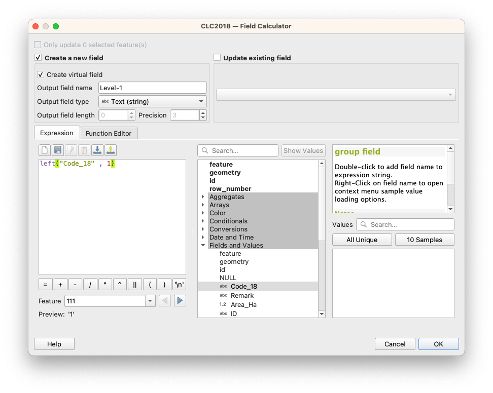
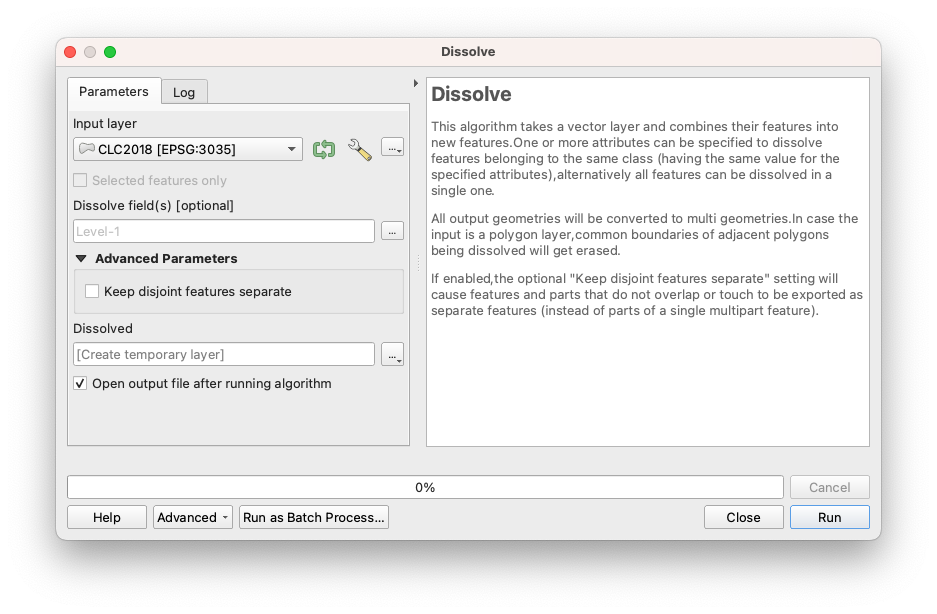
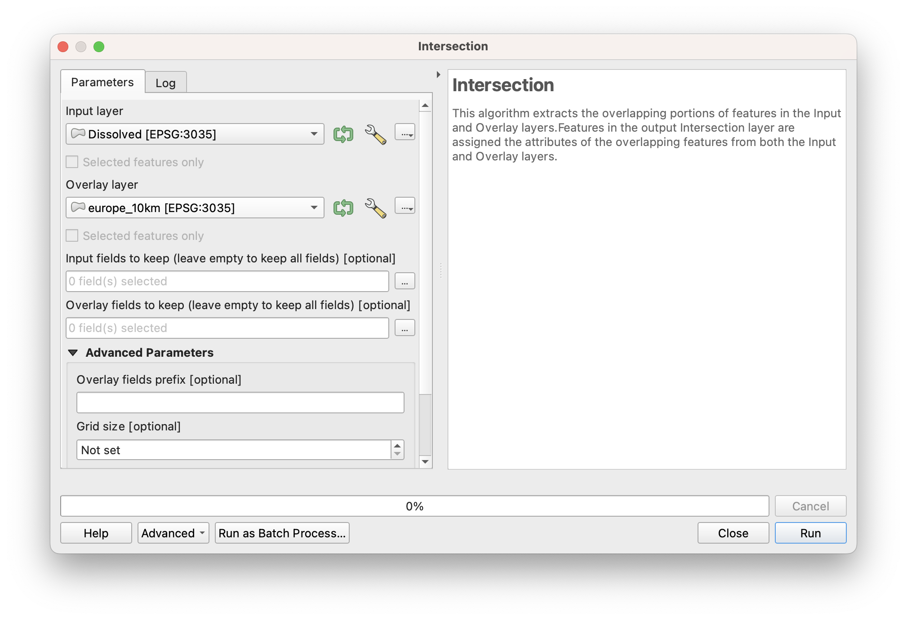
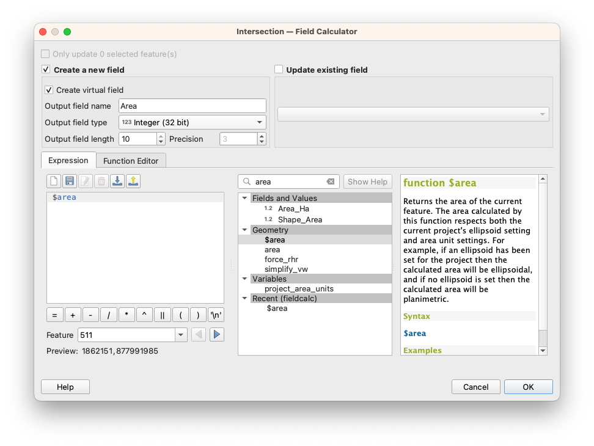
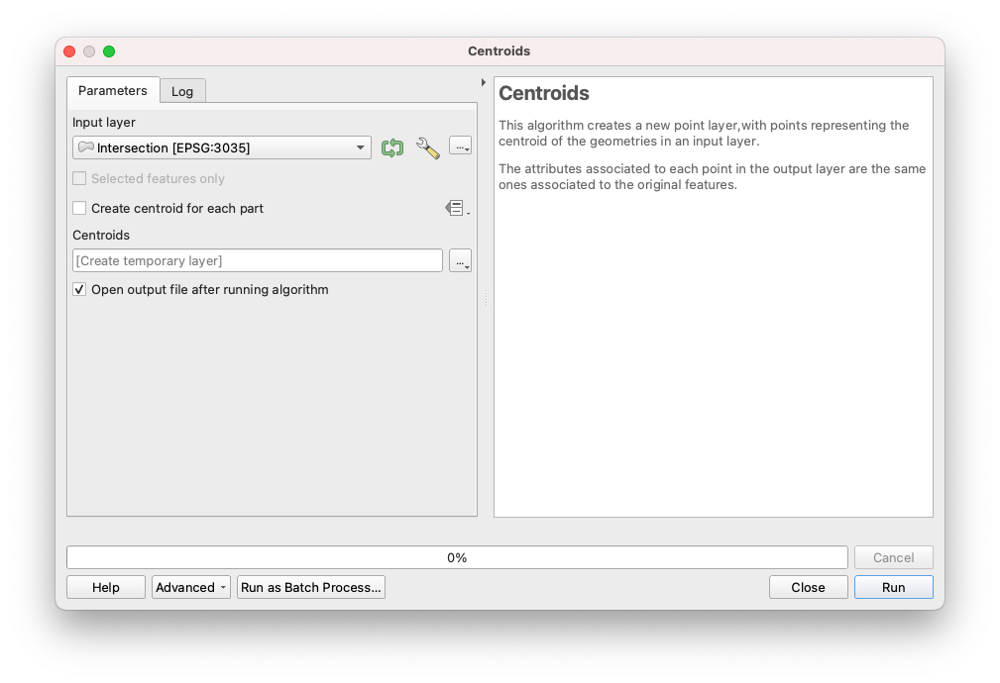
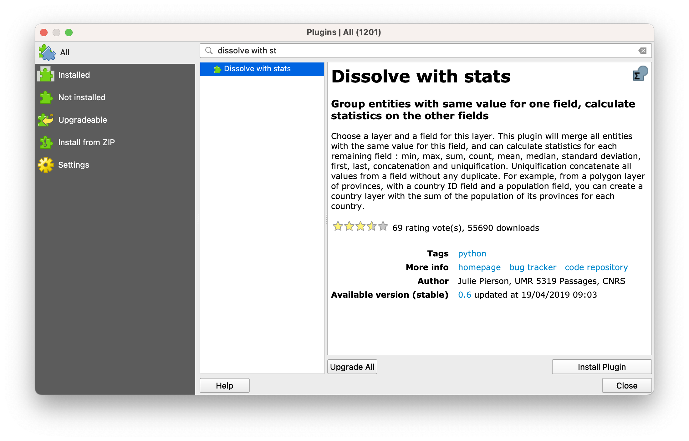
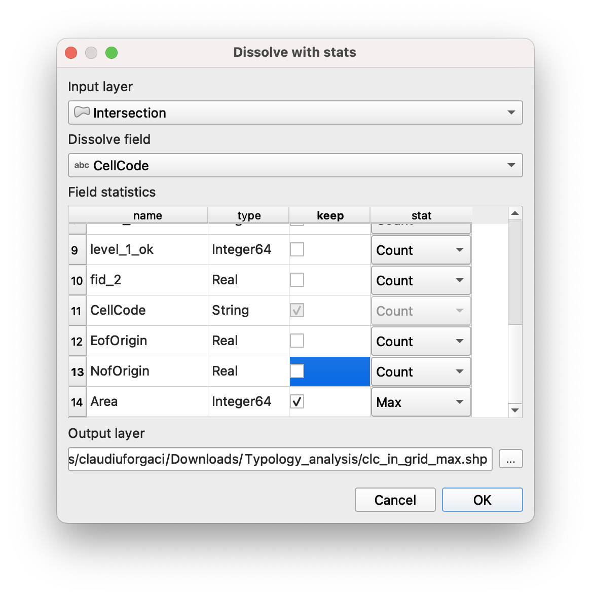
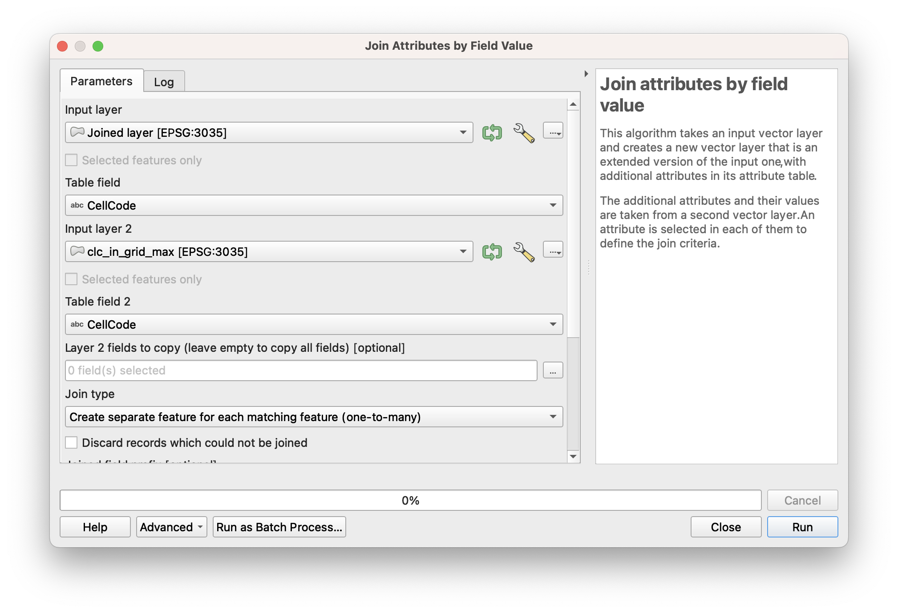
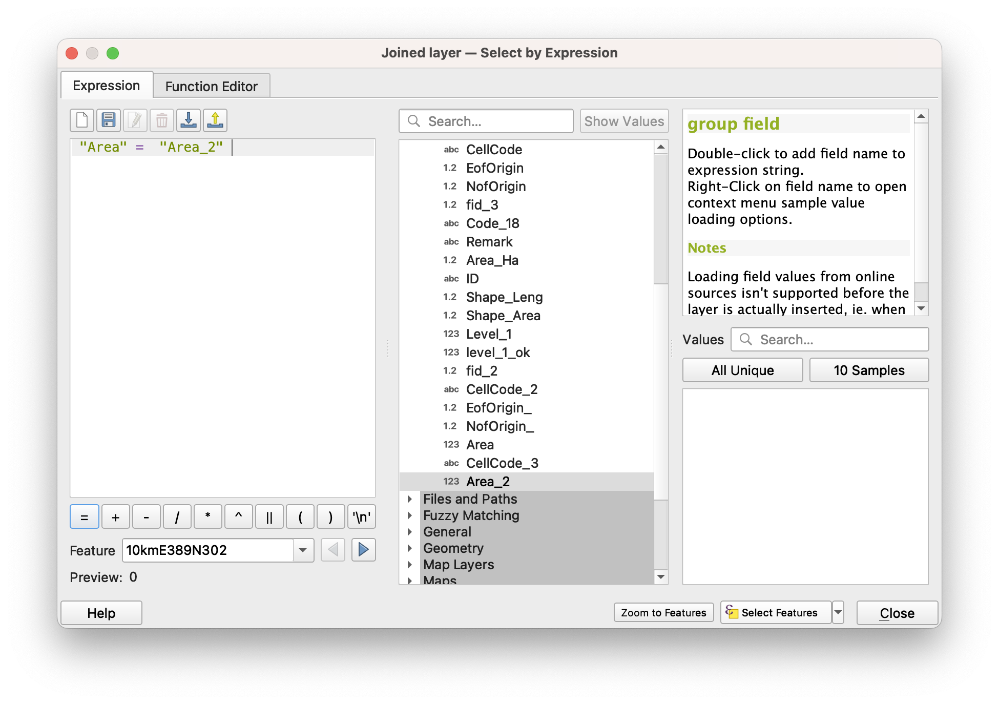
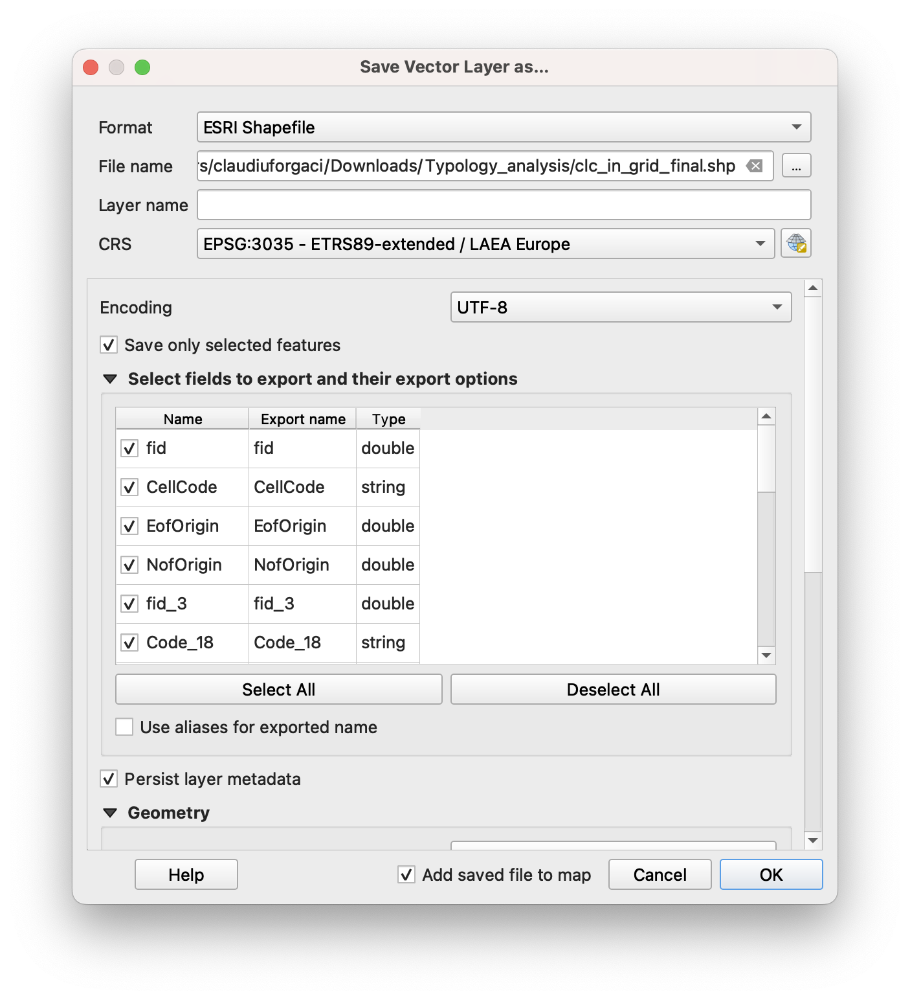

**Classification:** Intermediate GIS Analysis \| Spatial Data Processing \| Environmental Assessment \| Land Use Analysis

**Learning Level:** Intermediate

**Time Estimate:** 3–4 hours

**Software Required:** QGIS 3.40+ with Dissolve with stats plugin

**Author:** Updated from original by Claudiu Forgaci (2024)

------------------------------------------------------------------------

## Overview

This tutorial guides you through aggregating detailed land use classification data to a regular grid at the regional scale across Europe. You will work with Copernicus CLC (Corine Land Cover) data and a 2×2 km reference grid of the Netherlands to identify the dominant land use class in each grid cell, producing a simplified, grid-based representation of the landscape.

**Learning Outcomes:**

By completing this tutorial, you will be able to:

✅ Import and prepare large vector datasets for regional analysis\
✅ Extract Level-1 land use classes from hierarchical CLC classifications\
✅ Dissolve polygons by class to reduce geometric complexity\
✅ Fix invalid geometries in spatial data\
✅ Perform spatial intersection operations between raster-derived and grid geometries\
✅ Calculate polygon areas and identify dominant classes within grid cells\
✅ Use advanced dissolve and join operations to aggregate statistics by spatial unit\
✅ Produce a final grid layer with dominant land use classifications

------------------------------------------------------------------------

## System Requirements & Setup

### Software Installation

**QGIS:** - Download version 3.24 or later from https://qgis.org/download/ - Installation instructions vary by operating system

**Required QGIS Plugins:**

1.  **Dissolve with stats** – For dissolving geometries while computing summary statistics
    -   Go to **Plugins → Manage and Install Plugins**
    -   Search for "Dissolve with stats"
    -   Click **Install** and restart QGIS

### Data Requirements

You will need the following datasets:

-   **Copernicus CLC2018** – Corine Land Cover classification layer (vector polygons)
    -   Available from: https://land.copernicus.eu/en/products/corine-land-cover
    -   Should contain a `Code_18` field with Level-3 classification codes
-   **Netherlands 2×2 km Reference Grid** – Regular grid covering the Netherlands
    -   You can import it from the data folder. Alternatively, to create it, you can follow the tutorial on [how to create a fishnet](pages/spatial_data_preparation/creating-fishnet.qmd)
    -   Should contain a `CellCode` field for unique cell identification

**Coordinate Reference System:**

-   Both datasets must be reprojected to [**EPSG:28992 (Amersfoord / RD New)**](https://epsg.io/28992) before analysis
-   This ensures accurate area calculations and spatial operations

### Spatial Extent

The example in this tutorial covers:

**Bounding Box (GDAL format, in EPSG:3035 coordinates):** CHECK

```         
3,500,000.0 (West), 2,680,000.0 (South)
4,490,000.0 (East), 3,670,000.0 (North)
```

------------------------------------------------------------------------

## Workflow Overview

The analysis follows a sequential workflow moving from detailed to aggregated data:

| Phase | Tasks | Output |
|-----------------------|-----------------------|--------------------------|
| **Data Preparation** | Import and examine CLC data; identify Level-1 codes | Verified layers in EPSG:3035 |
| **Classification Simplification** | Extract Level-1 classes; identify invalid geometries | 5 major land use classes |
| **Geometry Repair** | Fix invalid polygons; dissolve by class | Valid, simplified CLC layer |
| **Spatial Intersection** | Overlay simplified CLC with grid; calculate areas | Intersection layer with areas |
| **Statistical Aggregation** | Identify dominant class per grid cell; join attributes | Final grid with land use classification |
| **Visualization** | Style and export results for presentation | Cartographic output |

------------------------------------------------------------------------

## Background: Understanding CLC Classification Levels

The Copernicus CLC dataset uses a hierarchical classification with three levels:

-   **Level 1 (5 classes):** Broad categories (Artificial surfaces, Agricultural areas, Forest, Herbaceous, Water)
-   **Level 2 (15 classes):** Intermediate detail (e.g., Urban fabric, Industrial areas, Pastures)
-   **Level 3 (44 classes):** Detailed categories (e.g., Continuous urban fabric, Discontinuous urban fabric)

**This tutorial focuses on Level 1** for regional-scale analysis. The first digit of any Level-3 code represents the Level-1 class.

Example: Code 112 (Discontinuous urban fabric) → Level-1 class = 1 (Artificial surfaces)

------------------------------------------------------------------------

## Step 1: Import and Prepare Data

### 1.1 Import Layers

1.  Launch **QGIS 3.40+**

2.  Import the CLC2018 layer:

    -   Go to **Layer → Add Layer → Add Vector Layer**
    -   Navigate to your CLC2018 shapefile or GeoPackage
    -   Click **Open**

3.  Import the Dutch 2×2 km grid:

    -   Go to **Layer → Add Layer → Add Vector Layer**
    -   Navigate to the grid layer
    -   Click **Open**

4.  Both layers should now appear in the **Layers Panel**

### 1.2 Verify Coordinate Reference System

Both layers must be in **EPSG:28992** for accurate results.

**Check CRS for each layer:**

1.  Right-click the CLC2018 layer and select **Layer CRS → Set Layer CRS**
2.  If not EPSG:3035, go to **Layer → Set Layer CRS → EPSG:3035** (not a full reproject—only for display)
3.  Repeat for the grid layer

**Reproject if necessary:**

If layers are in different CRS:

1.  Go to **Processing → Toolbox** and search for **Reproject layer**
2.  Double-click to open the tool
3.  **Input layer:** Select the CLC2018 layer
4.  **Target CRS:** Select **EPSG:3035**
5.  Click **Run** to reproject
6.  Repeat for the grid layer if needed

### 1.3 Examine the CLC Attribute Table

1.  Right-click the CLC2018 layer and select **Open Attribute Table**
2.  Locate the `Code_18` column
    -   This contains Level-3 codes (3 digits, ranging from 111 to 522)
3.  Note other attribute fields for reference (e.g., `OBJECTID`, `Area_HA`)
4.  Close the attribute table (you'll modify it in the next step)

------------------------------------------------------------------------

## Step 2: Extract Level-1 Classification Codes

Level-1 codes are represented by the **first digit** of the Level-3 code. We'll create a new field to store this simplified classification.

### 2.1 Open Field Calculator

1.  Right-click the CLC2018 layer and select **Open Attribute Table**
2.  In the **Attribute Table toolbar**, click the **Pencil icon** to enter **Edit Mode**
    -   The pencil icon turns yellow, indicating edit mode is active
3.  In the toolbar, click **Field Calculator** (calculator icon) or go to **Table → Field Calculator**

### 2.2 Create a New Field for Level-1 Code

In the **Field Calculator dialog:**

1.  Check the **Create a new field** option

2.  **Output field name:** Enter `Level_1`

3.  **Output field type:** Select **Whole number (integer)**

4.  **Expression:** Enter the following formula:

```         
to_int(LEFT(Code_18, 1))
```



This extracts the first character of the `Code_18` field and converts it to an integer.

**Explanation:** - `LEFT(Code_18, 1)` – Extracts the leftmost character from the Code_18 field - `to_int()` – Converts the text character to an integer (1, 2, 3, 4, or 5)

5.  Click **OK** to apply the formula

### 2.3 Verify the New Field

1.  In the **Attribute Table**, scroll right to find the new `Level_1` column
2.  Review several rows to confirm:
    -   Code_18 = 112 → Level_1 = 1 ✓
    -   Code_18 = 311 → Level_1 = 3 ✓
    -   Code_18 = 512 → Level_1 = 5 ✓
3.  Click the **Pencil icon** to exit edit mode
4.  When prompted, click **Save Changes** to confirm

------------------------------------------------------------------------

## Step 3: Simplify CLC Classification by Dissolving

Dissolving merges adjacent polygons with the same classification, reducing the total number of features from \~44 classes (Level 3) to 5 (Level 1).

### 3.1 Check for Invalid Geometries (optional)

Before dissolving, we must verify and fix any invalid geometries, which are common in large datasets like CLC.

**Run Validity Check:**

1.  Go to **Processing → Toolbox**
2.  Search for **Check validity**
3.  Double-click to open the tool

**Configure the tool:**

1.  **Input layer:** Select CLC2018

2.  **Method:** Select **GEOS**

3.  **Output valid geometries:** Create temporary layer (for inspection only)

4.  **Output invalid geometries:** Create temporary layer

5.  **Output errors:** Create temporary layer

6.  Click **Run**

**Interpret Results:**

-   The tool generates three output layers
-   **Invalid output** and **Error output** layers show which features have problems
-   Review these to understand the nature of invalid geometries (overlaps, self-intersections, etc.)
-   **Note:** You will not use these outputs; they are for information only. In case you encounter any problem with features, go to 3.2. If not, go to 3.3

### 3.2 Fix Invalid Geometries

1.  Go to **Processing → Toolbox**
2.  Search for **Fix geometries**
3.  Double-click to open the tool

**Configure the tool:**

1.  **Input layer:** Select CLC2018 (the original layer with invalid geometries)
2.  **Output:** Click the dropdown and select **Save to File** (or create a temporary layer)
3.  If saving to file:
    -   Click the folder icon to choose a location
    -   Enter filename: `CLC2018_fixed.shp`
4.  Click **Run**

**Result:**

-   A new layer `CLC2018_fixed` (or temporary layer) with corrected geometries will be created
-   Invalid geometries are repaired using geometric algorithms
-   Some topology may be altered, but the spatial extent and coverage remain valid

### 3.3 Dissolve by Level-1 Class

Now dissolve the fixed CLC layer by the `Level_1` field to merge all polygons of the same class.

**Open Dissolve Tool:**

1.  Go to **Vector → Geoprocessing Tools → Dissolve**
2.  Alternatively, search for **Dissolve** in the Processing Toolbox

**Configure Dissolve:**

1.  **Input layer:** Select `CLC2018_fixed` (the layer with corrected geometries)

2.  **Dissolve field:** Click the dropdown and select `Level_1`

    -   This will merge all polygons sharing the same Level_1 code

3.  **Output:** Click the dropdown and select **Save to File** (recommended for large datasets)

    -   Choose a location and enter: `CLC2018_Level1_dissolved.shp`

4.  **(Optional) Aggregate statistics:**

    -   If you want to preserve information from dissolved polygons (e.g., total area), you can configure aggregation here
    -   For now, leave unchecked unless you need additional statistics

5.  Click **Run**

**Result:**

-   A new layer with exactly 5 features (one per Level-1 class) will be created
-   Each feature represents all land of that class type, merged into single multi-part polygons
-   Attribute table will show the Level_1 code and any aggregated statistics



### 3.4 Verify the Dissolved Layer

1.  Open the **Attribute Table** of the dissolved layer
2.  You should see exactly **5 rows** (one for each Level-1 class):
    -   1 = Artificial surfaces
    -   2 = Agricultural areas
    -   3 = Forest and herbaceous vegetation
    -   4 = Wetlands
    -   5 = Water
3.  Close the attribute table

------------------------------------------------------------------------

## Step 4: Intersect Dissolved CLC with Grid

Intersection overlays the simplified CLC classes with the regular grid, creating a new layer where each polygon represents the portion of a grid cell covered by one land use class.

### 4.1 Run Intersection

1.  Go to **Vector → Geoprocessing Tools → Intersection**
2.  Alternatively, search for **Intersection** in the Processing Toolbox

**Configure Intersection:**

1.  **Input layer:** Select the dissolved CLC layer (`CLC2018_Level1_dissolved`)

2.  **Overlay layer:** Select the EEA grid layer

3.  **Output:** Click the dropdown and select **Save to File**

    -   Choose location and enter: `CLC_Grid_Intersection.shp`

4.  **(Optional) Input layer fields to keep:** Leave blank to keep all fields from both layers

5.  Click **Run**

**Processing:**

-   This operation may take several minutes depending on dataset size and complexity
-   A progress bar will show processing status
-   Once complete, a notification appears: "Finished"

**Result:**

-   A new layer `CLC_Grid_Intersection` is created
-   Each polygon represents the spatial overlap of a grid cell and a CLC Level-1 class
-   The attribute table contains fields from both input layers:
    -   Grid fields: `CellCode`, grid geometry fields
    -   CLC fields: `Level_1` (the land use class)



### 4.2 Verify Intersection Results

1.  Open the **Attribute Table** of the intersection layer
2.  Scroll right and confirm you can see:
    -   `CellCode` field (from grid)
    -   `Level_1` field (from CLC)
3.  Note the total number of features: This may be several thousand, as each grid cell can intersect multiple land use classes

------------------------------------------------------------------------

## Step 5: Calculate Polygon Areas

To identify the **dominant** land use class in each grid cell, we must calculate the area of each intersection polygon. The dominant class is the one with the largest area within the cell.

### 5.1 Add an Area Field

1.  Right-click the intersection layer and select **Open Attribute Table**
2.  Click the **Pencil icon** to enter **Edit Mode**
3.  Click the **Field Calculator** (calculator icon)

**In Field Calculator:**

1.  Check **Create a new field**

2.  **Output field name:** Enter `Area_m2`

3.  **Output field type:** Select **Decimal number (real)**

4.  **Expression:** Enter:

```         
$area
```

This built-in QGIS variable calculates the area of each polygon in the coordinate system units (square meters in EPSG:28992).

5.  Click **OK**



### 5.2 Verify Area Calculations

1.  Scroll right in the **Attribute Table** to see the new `Area_m2` column
2.  Review several values:
    -   All should be positive numbers
    -   Larger cells should have larger values
    -   No null or zero values should appear (if they do, there may be invalid geometries)
3.  Exit **Edit Mode:**
    -   Click the **Pencil icon**
    -   Click **Save Changes** when prompted

------------------------------------------------------------------------

## Step 6: Generate Centroids from Polygons

Centroids (center points) of intersection polygons will be used to join attributes back to the original grid.

### 6.1 Create Centroids

1.  Go to **Vector → Geometry Tools → Centroids**
2.  Alternatively, search for **Centroids** in the Processing Toolbox

**Configure Centroids:**

1.  **Input layer:** Select the intersection layer (`CLC_Grid_Intersection`)

2.  **Output:** Click dropdown and select **Save to File**

    -   Choose location and enter: `CLC_Grid_Intersection_Centroids.shp`

3.  Click **Run**

**Result:**

-   A new point layer is created with one point at the center of each intersection polygon
-   The attribute table includes all fields from the input (intersection) layer:
    -   `CellCode`, `Level_1`, `Area_m2`, etc.



### 6.2 Verify Centroid Layer

1.  In the main canvas, the centroids should appear as points distributed across your study area
2.  Open the **Attribute Table** to confirm fields are preserved
3.  The number of points should equal the number of features in the intersection layer

------------------------------------------------------------------------

## Step 7: Join Centroids to Original Grid

This step transfers attributes from the centroids back to the original grid layer using a spatial join.

### 7.1 Run Spatial Join

1.  Go to **Processing → Toolbox**
2.  Search for **Join Attributes by Location**
3.  Double-click to open

**Configure Join:**

1.  **Input layer:** Select the original EEA grid layer
    -   This is the target layer that will receive new attributes
2.  **Join layer:** Select the centroids layer (`CLC_Grid_Intersection_Centroids`)
    -   This provides the attributes to join
3.  **Geometric predicate:** Select **Contains** (or **Intersects**)
    -   This means: for each grid cell, find centroids that fall within it
4.  **Join type:** Select **One-to-many** or **Take attributes of the first located feature** (depending on your QGIS version)
    -   This ensures one grid cell can be joined to multiple centroid features
5.  **Output:** Click dropdown and select **Save to File**
    -   Enter: `Grid_with_Centroid_Attributes.shp`
6.  Click **Run**

**Result:**

-   A new layer is created containing the original grid with added fields from centroids
-   Each grid cell may now have multiple records if it intersects multiple land use classes
-   Attributes include: `CellCode`, `Level_1`, `Area_m2`, and other fields

------------------------------------------------------------------------

## Step 8: Install Dissolve with stats Plugin

This plugin is essential for the next step, as it dissolves features while computing summary statistics (in this case, identifying the maximum area).

### 8.1 Install Plugin

1.  Go to **Plugins → Manage and Install Plugins**

2.  In the search bar, type: `Dissolve with stats`

3.  Click on the plugin in the results list

4.  Click **Install plugin**

5.  Once installed, a notification appears: "Plugin installed successfully"

6.  **Restart QGIS** to activate the plugin

### 8.2 Verify Installation

After restart:

1.  Go to **Processing → Toolbox**
2.  Search for `Dissolve with stats`
3.  You should see the plugin's tool listed
4.  If not visible, enable it: **Plugins → Manage and Install Plugins** → check the plugin is enabled



------------------------------------------------------------------------

## Step 9: Identify Dominant Land Use Class per Grid Cell

Using the Dissolve with stats plugin, we dissolve the joined layer by grid cell and identify which land use class has the **maximum area** within each cell.

### 9.1 Open Dissolve with stats

1.  Go to **Processing → Toolbox**
2.  Search for **Dissolve with stats**
3.  Double-click to open the tool dialog

**Configure Dissolve with stats:**

1.  **Input layer:** Select the joined layer (`Grid_with_Centroid_Attributes`)

2.  **Dissolve field:** Click dropdown and select `CellCode`

    -   This groups all records by grid cell

3.  **Statistics to calculate:**

    -   Locate the **Area_m2** field
    -   For this field, select **Max** from the function dropdown
    -   This identifies the largest area (dominant class) per grid cell

4.  **Output:** Click dropdown and select **Save to File**

    -   Enter: `Grid_Dominant_Class_Stats.shp`

5.  Click **Run**



**Result:**

-   A new layer is created with one record per grid cell
-   A new field (e.g., `Area_m2_max`) shows the maximum area value for each cell
-   This identifies which land use class dominates each grid cell

------------------------------------------------------------------------

## Step 10: Join Dominant Class Information Back to Grid

We must now join the maximum area information back to the full dataset to filter for only the dominant classes.

### 10.1 Run Field Value Join

1.  Go to **Processing → Toolbox**
2.  Search for **Join Attributes by Field Value**
3.  Double-click to open

**Configure Join:**

1.  **Input layer:** Select the layer from Step 7 (`Grid_with_Centroid_Attributes`)

    -   This is the layer with all grid cell-land use class combinations

2.  **Table field:** Select `CellCode` (in the input layer)

3.  **Input layer 2:** Select the result from Step 9 (`Grid_Dominant_Class_Stats`)

    -   This contains the maximum area values

4.  **Table field 2:** Select `CellCode` (matching field in input layer 2)

5.  **Join type:** Select **One-to-many** or **Concatenate joined fields**

    -   This allows one grid cell to be matched to its dominant class record

6.  **Output:** Click dropdown and select **Save to File**

    -   Enter: `Grid_with_Max_Area_Info.shp`

7.  Click **Run**

**Result:**

-   A new layer with joined maximum area information
-   Each record now has access to the `Area_m2_max` value for its grid cell
-   Records where `Area_m2` equals `Area_m2_max` represent dominant land use classes



------------------------------------------------------------------------

## Step 11: Filter for Dominant Classes

Now filter the joined layer to keep only the records where the area of the intersection polygon equals the maximum area in that grid cell. These represent the dominant land use classes.

### 11.1 Apply Attribute Filter

1.  Right-click the joined layer (`Grid_with_Max_Area_Info`) and select **Filter...**
    -   Alternatively, go to **Vector → Filter...**
2.  In the **Query Builder** dialog:
    -   Build a filter expression: `Area_m2 = Area_m2_max`
    -   (Exact field names may vary; use the field names from your dataset)
3.  Click **OK** to apply the filter



**Result:**

-   The layer now displays only features where area equals maximum area
-   These represent the dominant land use class in each grid cell

### 11.2 Save Filtered Results

1.  Right-click the filtered layer and select **Export → Save As**

2.  **Save as:**

    -   Format: Shapefile (.shp) or GeoPackage (.gpkg)
    -   Filename: `Grid_Dominant_CLC_Final.shp`

3.  Check **Save only selected features** (to save the filtered results)

4.  Click **Save**




**Result:**

-   A new layer containing only the dominant land use class per grid cell
-   This is your final output for mapping and analysis

------------------------------------------------------------------------

## Step 12: Visualize and Style Results

### 12.1 Style the Final Grid Layer

1.  Select the final grid layer (`Grid_Dominant_CLC_Final`) in the Layers Panel

2.  Open **Layer Styling** (**View → Panels → Layer Styling** or press **F7**)

3.  In the **Symbology** tab, change to **Categorized** classification

4.  **Value:** Select `Level_1` (the land use class field)

5.  **Color ramp:** Choose a categorical colour scheme (e.g., Set 1, Pastel1)

6.  Click **Classify** to generate symbols for each class

7.  Assign meaningful colours:

    -   **Level 1 (Artificial surfaces):** Red or grey
    -   **Level 2 (Agricultural):** Yellow or tan
    -   **Level 3 (Forest):** Green
    -   **Level 4 (Wetlands):** Blue/purple
    -   **Level 5 (Water):** Blue

8.  Double-click colours to customize as desired

9.  Click **Apply** to visualize

### 12.2 Add Map Elements

In a **Print Layout**, add:

1.  **Title:** "Dominant Land Use Classes – Regional Grid Analysis"
2.  **Legend:** Showing the 5 Level-1 classes with colours
3.  **Scale bar:** Appropriate for your study region
4.  **North arrow:** For geographic orientation
5.  **Source attribution:** Credit to Copernicus/EEA

### 12.3 Export Final Map

1.  Go to **Layout → Export as PDF** or **Export as Image**
2.  Set resolution to **300 DPI** for print quality
3.  Choose output location and filename
4.  Click **Save**

------------------------------------------------------------------------

## Troubleshooting Guide

| Problem | Cause | Solution |
|-------------------------|--------------------|----------------------------|
| **Dissolve operation fails** | Invalid geometries in CLC layer | Run "Check validity" and "Fix geometries" before dissolving. Use the fixed layer for subsequent operations. |
| **Intersection produces very large output** | High-resolution CLC polygons create many intersections | This is normal. Consider subsetting to a smaller study area if processing is too slow. |
| **Area calculations show zero or null values** | Geometries are invalid or in wrong CRS | Ensure CRS is EPSG:3035. Run "Fix geometries" if needed. Recalculate area field. |
| **Dissolve with stats not found** | Plugin not installed or activated | Install via **Plugins → Manage and Install Plugins**. Restart QGIS. Ensure plugin is enabled. |
| **Join produces unexpected results** | Mismatched field names or incorrect join type | Verify field names match exactly (case-sensitive). Check join type is "One-to-many". Inspect sample records. |
| **Dominant class identification is incorrect** | Floating-point comparison errors; Area_m2 ≠ Area_m2_max due to rounding | Use **Area_m2 \>= Area_m2_max \* 0.99** in filter to account for rounding errors. |
| **Final grid has missing cells** | Some grid cells don't contain any CLC data | This is normal if grid extends beyond CLC coverage. Consider masking to valid areas only. |
| **Processing is very slow** | Large dataset; insufficient system memory | Reduce study area; work with smaller regions sequentially. Close other applications. Consider using "Create Temporary Layer" rather than saving large intermediate files. |

------------------------------------------------------------------------

## Interpretation Guidelines

**Understanding the Results:**

-   **One Level-1 class per grid cell:** The final grid shows the single most prevalent land use type in each 2×2 km cell
-   **Spatial patterns:** Visible gradients reveal regional land use structure (urban cores, agricultural zones, forested areas)
-   **Level of detail:** Level-1 classification is suitable for regional planning and policy; Level-2 or Level-3 needed for local detail

**Using the Grid for Analysis:**

-   **Statistical summaries:** Count grid cells by dominant class; calculate percentages by region
-   **Change detection:** Compare grids from different years (if CLC data available for multiple epochs)
-   **Integration with other data:** Join socioeconomic, demographic, or climate data to explore correlations
-   **Planning applications:** Identify expansion opportunities or conservation priorities

------------------------------------------------------------------------

## Extensions and Advanced Topics

Once you complete this tutorial, consider:

1.  **Multi-level Classification:** Repeat the workflow using Level-2 or Level-3 classes for finer detail in specific regions

2.  **Proportion-based Aggregation:** Instead of dominant class, calculate the **percentage** of each land use type per grid cell

3.  **Temporal Analysis:** Repeat for CLC2012 and CLC2018 to assess land use change over time

4.  **Accuracy Assessment:** Compare dominant classes with ground-truth data or high-resolution imagery

5.  **Zonal Statistics Alternative:** Use QGIS's **Zonal Statistics** tool as an alternative workflow (may be faster for large datasets)

6.  **Custom Grid Resolutions:** Replace the 2×2 km grid with finer (1×1 km) or coarser (10×10 km) grids for different analytical scales

7.  **Export for Web Mapping:** Convert results to GeoJSON or Tiles for interactive web-based visualization

------------------------------------------------------------------------

## References & Resources

**Data Sources:**

-   **Copernicus CLC2018:** https://land.copernicus.eu/en/products/corine-land-cover
-   **CLC User Manual:** https://land.copernicus.eu/en/technical-library/clc-product-user-manual/

**QGIS Documentation:**

-   **Vector Geoprocessing Tools:** https://docs.qgis.org/latest/en/docs/user_manual/processing_algs/qgis/vectorgeoprocessing.html
-   **Processing Toolbox:** https://docs.qgis.org/latest/en/docs/user_manual/processing/toolbox.html
-   **Dissolve with stats Plugin:** Check plugin repository or GitHub

**Related Tutorials:**

-   QGIS official training manual: https://docs.qgis.org/latest/en/docs/training_manual/
-   European Environment Agency GIS resources: https://www.eea.europa.eu/data-and-maps

------------------------------------------------------------------------

## Quick Reference: Key Tools

| Task | Tool Path | Purpose |
|------------------|-----------------------------|-------------------------|
| Add layer | **Layer → Add Layer** | Import CLC and grid data |
| Edit attributes | **Right-click layer → Open Attribute Table** | Create Level-1 field |
| Field calculator | **Attribute Table → Field Calculator** | Extract Level-1 code; calculate area |
| Check validity | **Processing → Check validity** | Identify invalid geometries |
| Fix geometries | **Processing → Fix geometries** | Repair invalid polygons |
| Dissolve | **Vector → Geoprocessing Tools → Dissolve** | Merge polygons by class |
| Intersection | **Vector → Geoprocessing Tools → Intersection** | Overlay CLC with grid |
| Centroids | **Vector → Geometry Tools → Centroids** | Create center points |
| Spatial join | **Processing → Join Attributes by Location** | Link grid to centroids |
| Dissolve with stats | **Processing → Dissolve with stats** | Find maximum area per cell |
| Field value join | **Processing → Join Attributes by Field Value** | Link dominant class info |
| Filter | **Vector → Filter** | Select dominant classes only |

------------------------------------------------------------------------

## Appendix: Understanding CLC Level Codes

**Level-1 Classes (First Digit):**

| Code | Class Name | Characteristics |
|------------------|----------------------|--------------------------------|
| 1 | Artificial surfaces | Urban, industrial, mining, construction |
| 2 | Agricultural areas | Arable land, permanent crops, pastures |
| 3 | Forest and herbaceous | Forests, herbaceous vegetation, sparse vegetation |
| 4 | Wetlands | Inland and coastal wetlands |
| 5 | Water | Rivers, lakes, coastal water |

**Example Level-3 Codes:**

-   111 = Continuous urban fabric
-   112 = Discontinuous urban fabric
-   211 = Non-irrigated arable land
-   231 = Pastures
-   311 = Broad-leaved forest
-   312 = Coniferous forest
-   511 = Rivers
-   512 = Lakes

------------------------------------------------------------------------

**Document Version:** 1.0 (Updated February 2026)\
**QGIS Version:** 3.40+\
**Difficulty Level:** Intermediate\
**Expected Time:** 2–3 hours\
**Data Scale:** Regional (Europe)\
**Output Scale:** 10×10 km grid cells

------------------------------------------------------------------------

## Feedback & Support

If you encounter issues or have questions:

-   Review the **Troubleshooting Guide** in this document
-   Check **QGIS documentation** at https://docs.qgis.org/
-   Consult **Copernicus and EEA documentation** for data-specific questions
-   Contact your instructor or GIS support team

------------------------------------------------------------------------
